# BattleKinmen

資工三 陳彥辰 111010523  
資工三 李易 111010512  
資工三 陳先正 111010540  
資工三 范楊政 111010519  
資工三 黃柏鈞 111010520

## 專案簡介

本專案將探討戰爭槍戰遊戲的開發過程，以及遊戲如何透過遊戲性、敘事、美術和技術元素來吸引玩家並提供極具娛樂價值的體驗。我們將研究成功的遊戲案例，以了解其設計和發展的最佳實踐。

## 模型匯入

由於 GitHub 預設只能上傳 `< 100MB` 的檔案 (使用 GitLFS 會限制流量)，因此我們決定使用 Unity Cloud 提供的 [Asset Manager](https://unity.com/products/asset-manager) 來進行大檔案的上傳。以下是相關步驟：

### 上傳

1. 前往 [Unity Cloud](https://cloud.unity.com/home/login?redirectTo=Lw==) 進行登入。
2. 登入完畢後，點擊左方側邊欄中的**項目**，並尋找我們的專案 (BattleKinmen)。  
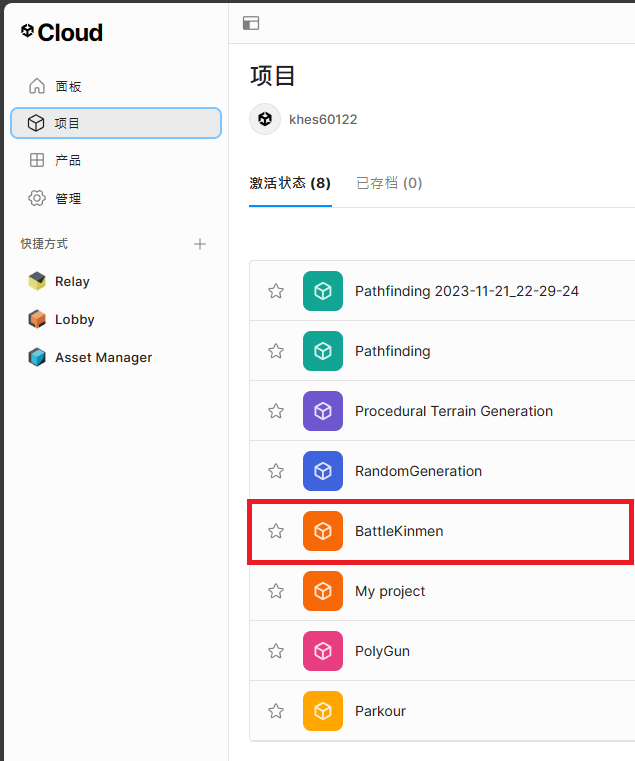
3. 點擊我們的專案後，在底下的**服務**欄位中，尋找 Asset Manager。  
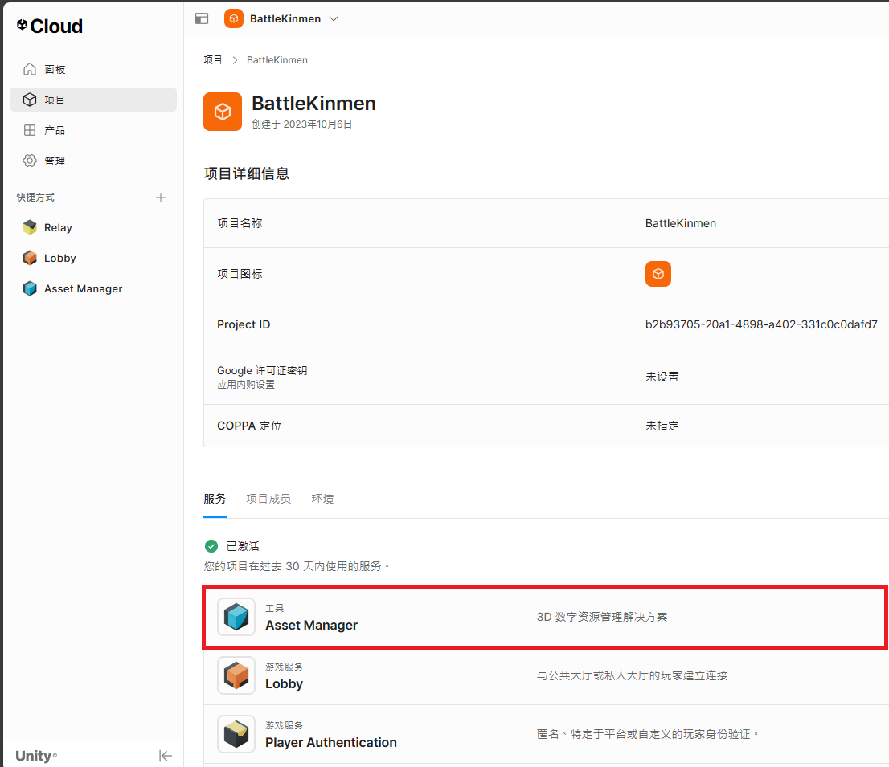
4. 點擊 Asset Manager 後，再次從右方尋找我們的專案 (BattleKinmen)。  
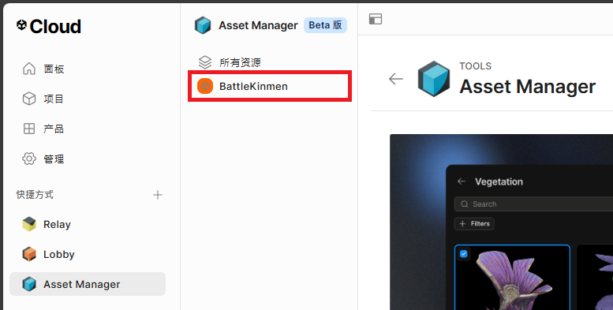
5. 點擊我們的專案後，點擊右上方的 `+ Add` 按鈕即可上傳檔案。  
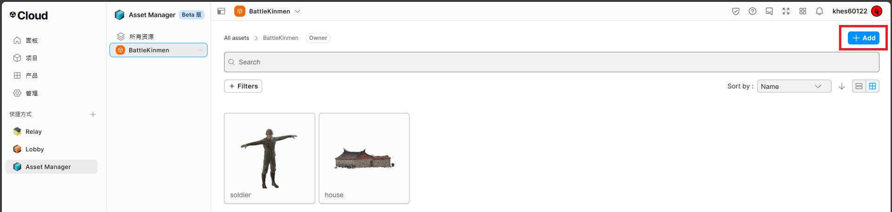
6. 在上傳時，選擇"Add asset"。  
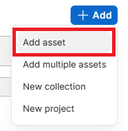
7. 然後再點擊"File upload"，尋找你要上傳的檔案。  
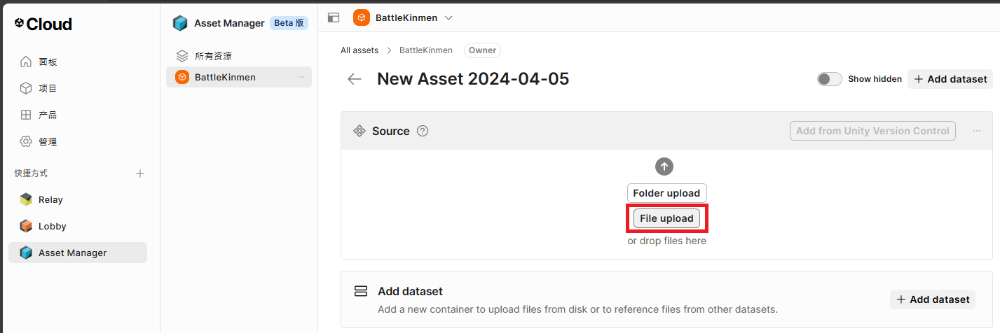  
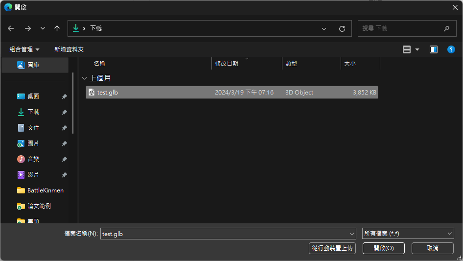
8. 上傳完畢後，即可回到上一頁查看。  
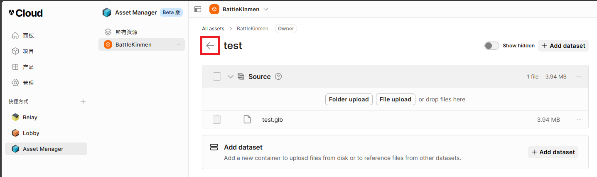  
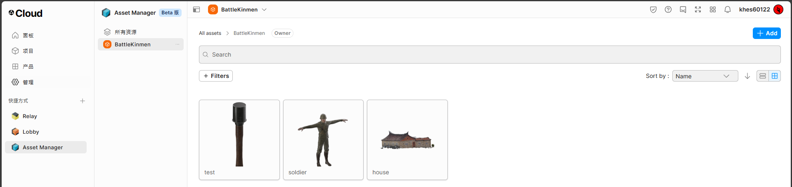

### 下載

1. 打開 GitHub Desktop 進行 pull。
2. 打開 Unity 專案，並等它載入完畢。
3. 點擊 Unity 工作列的 Window，並選擇 Asset Manager。  
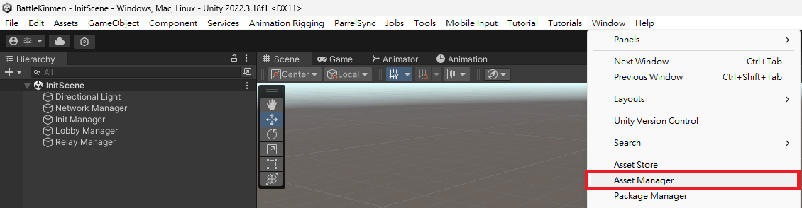
4. 點擊你想下載的模型，並按下右方的 Import / Reimport。  
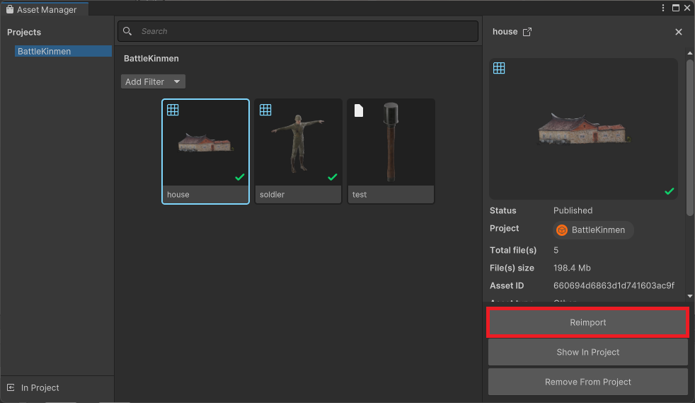  
如果有出現以下視窗，就按 Yes  
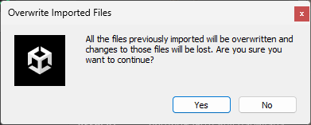  
如果有出現以下視窗，就按 Continue  
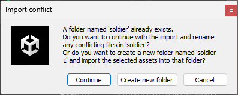
5. 重複步驟 `4`，直到所有模型都下載完畢。
6. 回到 GitHub Desktop，把有出現黃框的檔案，全部 discard 掉。  
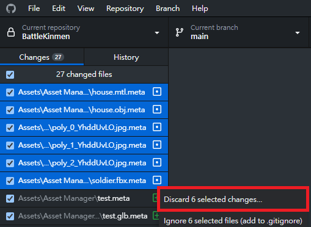  
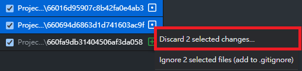
7. 如果有綠框的檔案，就進行 push。

## 注意事項

1. 在對程式檔案進行更改時，請記得跟其他人協調好，不要更動到同一個檔案。
2. 在對程式檔案進行更改後，請記得加上註解，[並使用 Unicode 編碼方式進行儲存](https://www.youtube.com/watch?v=9HyTL9A08yE)。
3. 在對程式檔案進行 push/pull 時，請使用 github desktop 工具，以免出錯。
4. 在對程式檔案進行 push 後，請在 LINE 群通知其他同學。
