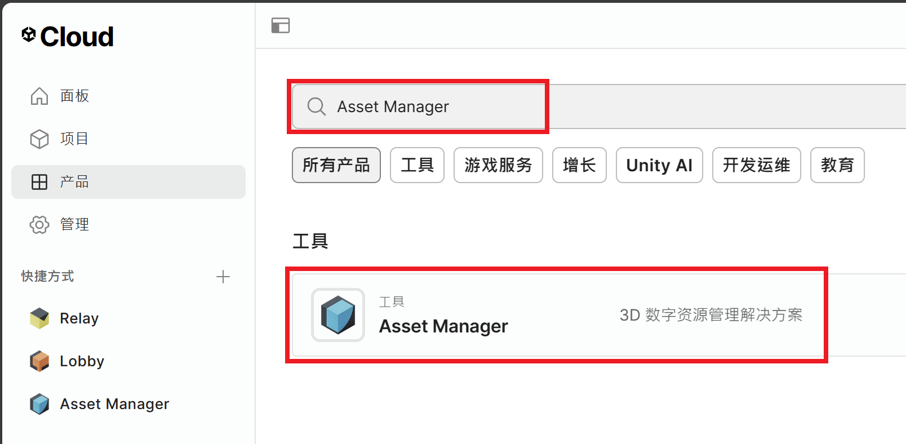
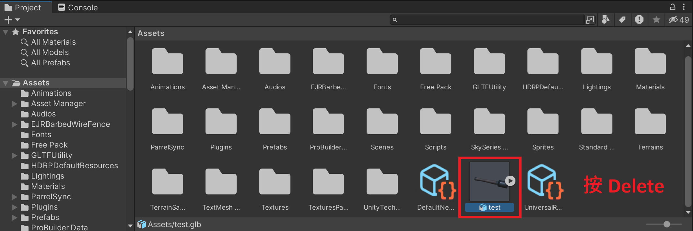

# BattleKinmen

資工三 陳彥辰 111010523  
資工三 李易 111010512  
資工三 陳先正 111010540  
資工三 范楊政 111010519  
資工三 黃柏鈞 111010520

## 專案簡介

本專案將探討戰爭槍戰遊戲的開發過程，以及遊戲如何透過遊戲性、敘事、美術和技術元素來吸引玩家並提供極具娛樂價值的體驗。我們將研究成功的遊戲案例，以了解其設計和發展的最佳實踐。

## 專案下載

先在要放專案的位置打開終端機，再依序輸入以下指令：

```
git clone https://github.com/LeeYi-user/BattleKinmen.git --depth 1
cd BattleKinmen
git fetch --unshallow
```

輸入完畢後記得啟動 Unity 專案，並進行[模型下載](#模型下載)。

## 模型上傳

由於 GitHub 預設只能上傳 `< 100MB` 的檔案 (使用 GitLFS 會限制流量)，因此我們決定使用 Unity Cloud 提供的 [Asset Manager](https://unity.com/products/asset-manager) 來進行大檔案的上傳。以下是相關步驟：

1. 把檔案丟到 Unity 專案底下。  

2. 前往 [Unity Cloud](https://cloud.unity.com/home/login?redirectTo=Lw==) 進行登入。
3. 登入完畢後，點擊左方側邊欄中的**產品**，並尋找 Asset Manager。  

4. 點擊 Asset Manager 後，從右方尋找我們的專案 (BattleKinmen)。  

5. 點擊我們的專案後，點擊右上方的 `+ Add` 按鈕即可上傳檔案。  

6. 在上傳時，選擇 `Add asset`。  

7. 點擊 `File upload`，尋找剛才丟進專案的檔案及其附屬的 `.meta` 檔。  
  

8. 上傳完畢後，刪除專案內的檔案。  


## 模型下載

由於 Asset Manager 內的模型並不在 GitHub 上，因此要使用以下的步驟來進行匯入：

1. 點擊 Unity 工作列的 Window，並選擇 Asset Manager。  

2. 點擊還沒下載的模型，並按下右方的 Import。  

3. 重複步驟 `2`，直到所有模型都下載完畢。

## 注意事項

1. 在對程式檔案進行更改時，請記得跟其他人協調好，不要更動到同一個檔案。
2. 在對程式檔案進行更改後，請記得加上註解，[並使用 Unicode 編碼方式進行儲存](https://learn.microsoft.com/zh-tw/visualstudio/ide/encodings-and-line-breaks?view=vs-2022)。
3. 在對程式檔案進行 push/pull 時，請使用 github desktop 工具，以免出錯。
4. 在對程式檔案進行 push 後，請在 LINE 群通知其他同學。
